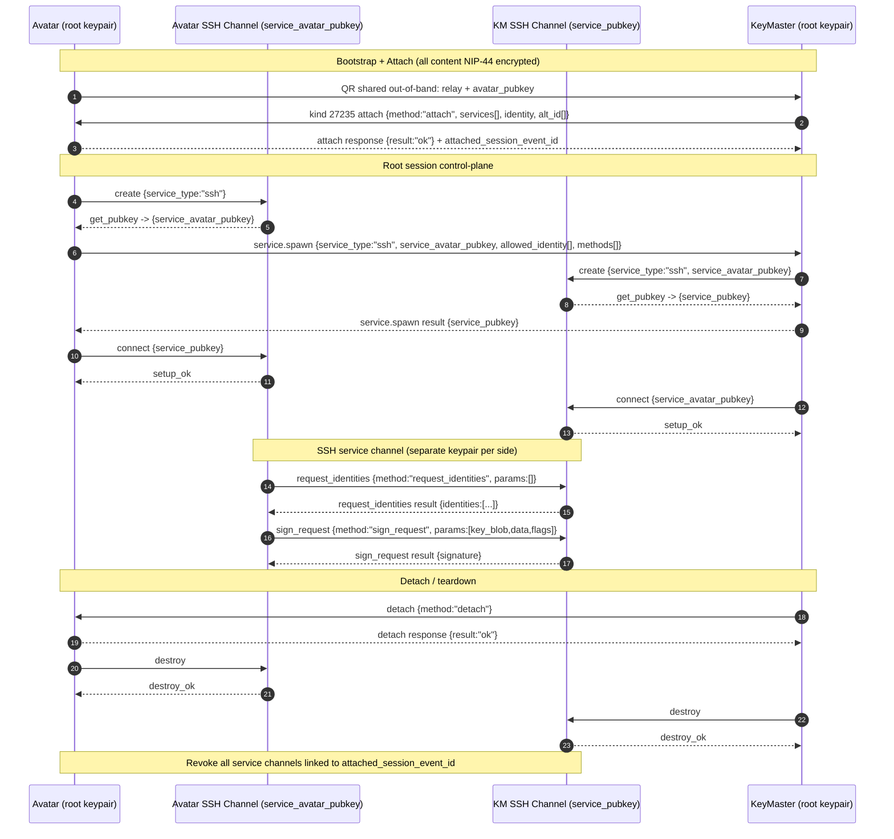

# Avatar <-> KeyMaster Nostr Scenario (Mermaid)

## Tagging Rules (applies to the sequence above)

- All requests include:
  - `p` tag addressed to the receiver pubkey
  - `e` tag with session descriptor:
    - root requests: `["e","<attached_session_event_id>","","session"]`
    - service requests: `["e","<service_session_event_id>","","session"]`
- All responses include:
  - `p` tag addressed to requester pubkey
  - `e` reply tag: `["e","<request_event_id>","","reply"]`
- Response does not require a `session` tag.
