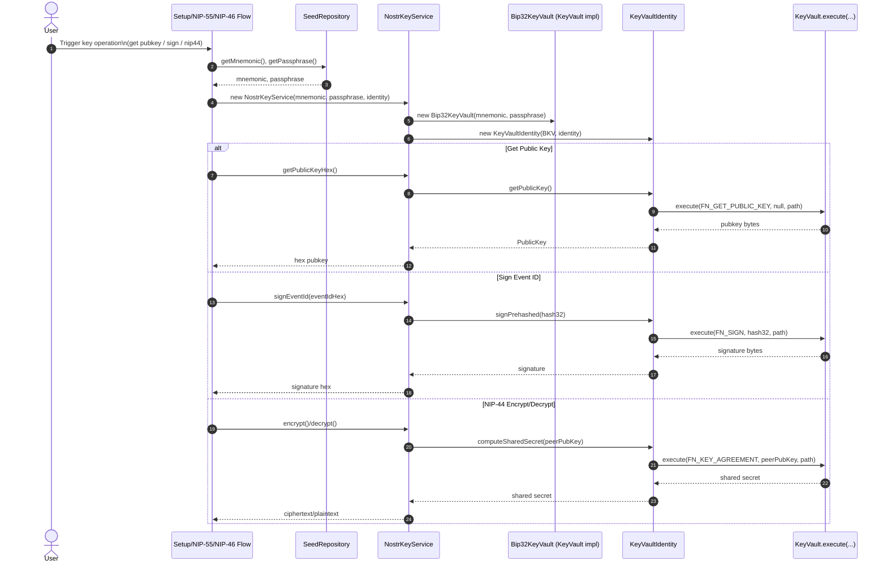

# Key Access Sequence (Android KeyMaster)

```mermaid
sequenceDiagram
    autonumber
    actor User
    participant UI as Setup/NIP-55/NIP-46 Flow
    participant SeedRepo as SeedRepository
    participant NKS as NostrKeyService
    participant BKV as Bip32KeyVault (KeyVault impl)
    participant KVI as KeyVaultIdentity
    participant Vault as KeyVault.execute(...)

    User->>UI: Trigger key operation\n(get pubkey / sign / nip44)
    UI->>SeedRepo: getMnemonic(), getPassphrase()
    SeedRepo-->>UI: mnemonic, passphrase

    UI->>NKS: new NostrKeyService(mnemonic, passphrase, identity)
    NKS->>BKV: new Bip32KeyVault(mnemonic, passphrase)
    NKS->>KVI: new KeyVaultIdentity(BKV, identity)

    alt Get Public Key
        UI->>NKS: getPublicKeyHex()
        NKS->>KVI: getPublicKey()
        KVI->>Vault: execute(FN_GET_PUBLIC_KEY, null, path)
        Vault-->>KVI: pubkey bytes
        KVI-->>NKS: PublicKey
        NKS-->>UI: hex pubkey
    else Sign Event ID
        UI->>NKS: signEventId(eventIdHex)
        NKS->>KVI: signPrehashed(hash32)
        KVI->>Vault: execute(FN_SIGN, hash32, path)
        Vault-->>KVI: signature bytes
        KVI-->>NKS: signature
        NKS-->>UI: signature hex
    else NIP-44 Encrypt/Decrypt
        UI->>NKS: encrypt()/decrypt()
        NKS->>KVI: computeSharedSecret(peerPubKey)
        KVI->>Vault: execute(FN_KEY_AGREEMENT, peerPubKey, path)
        Vault-->>KVI: shared secret
        KVI-->>NKS: shared secret
        NKS-->>UI: ciphertext/plaintext
    end
```
