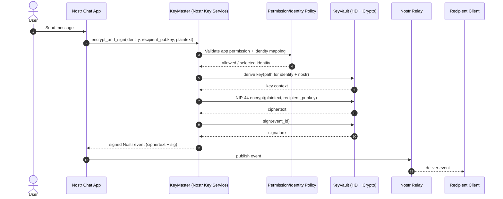

# Nostr Chat App -> Nostr Key Service Sequence

```mermaid
sequenceDiagram
    autonumber
    actor User
    participant ChatApp as Nostr Chat App
    participant KM as KeyMaster (Nostr Key Service)
    participant Policy as Permission/Identity Policy
    participant Vault as KeyVault (HD + Crypto)
    participant Relay as Nostr Relay
    participant Peer as Recipient Client

    User->>ChatApp: Send message
    ChatApp->>KM: encrypt_and_sign(identity, recipient_pubkey, plaintext)

    KM->>Policy: Validate app permission + identity mapping
    Policy-->>KM: allowed / selected identity

    KM->>Vault: derive key(path for identity + nostr)
    Vault-->>KM: key context

    KM->>Vault: NIP-44 encrypt(plaintext, recipient_pubkey)
    Vault-->>KM: ciphertext

    KM->>Vault: sign(event_id)
    Vault-->>KM: signature

    KM-->>ChatApp: signed Nostr event (ciphertext + sig)
    ChatApp->>Relay: publish event
    Relay-->>Peer: deliver event
```
